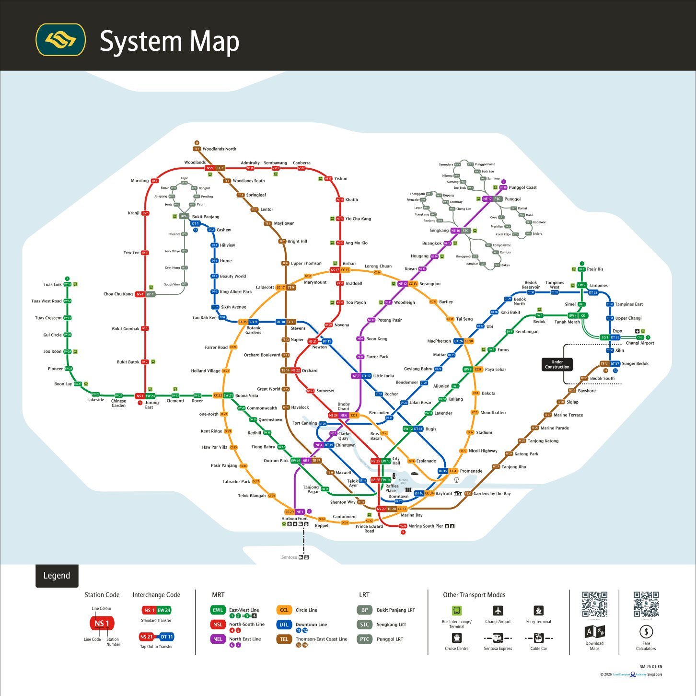
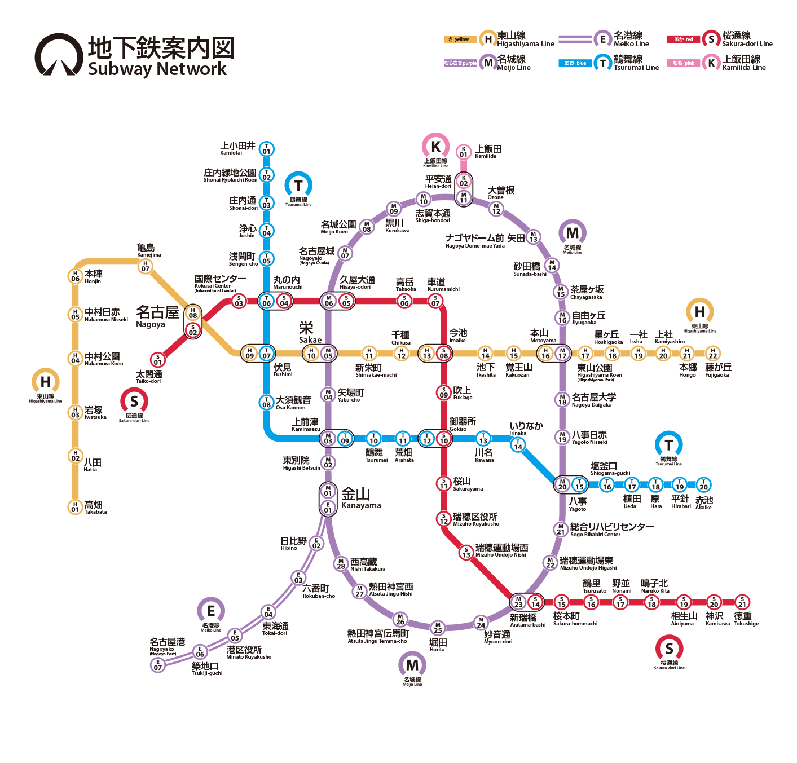
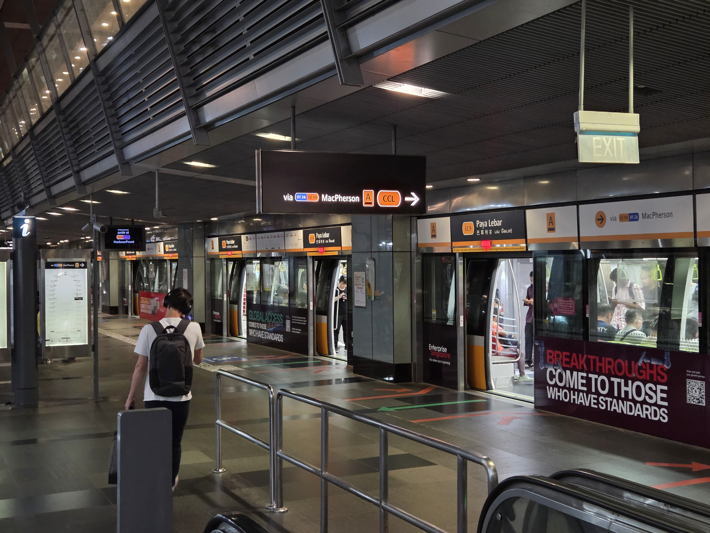
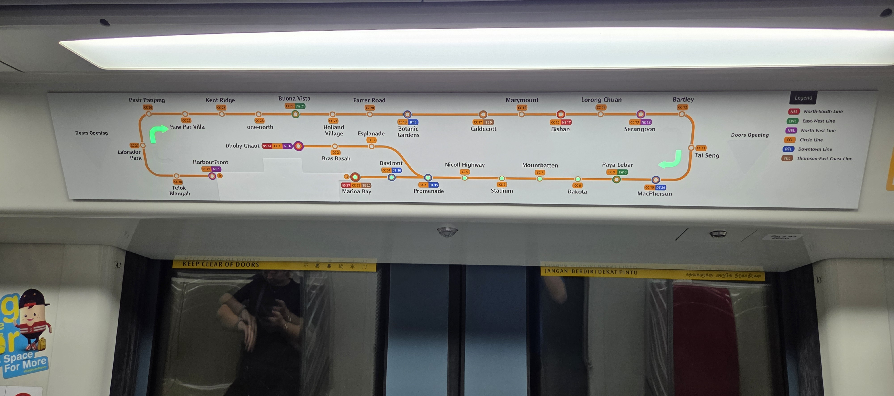
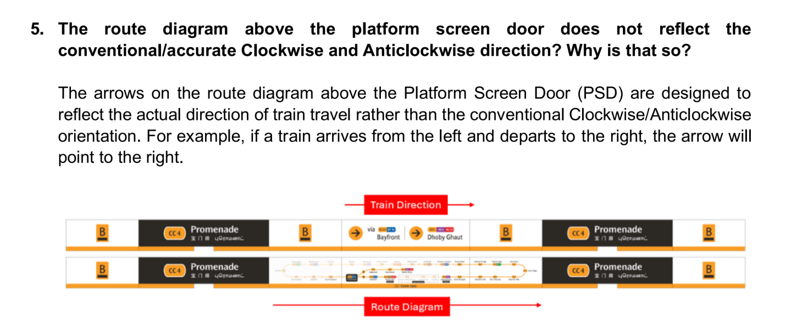

import '../../styles/ccl-wayfinding.css';
import HoverText from '../../components/mdx/HoverText.jsx';
import Collapsible from '../../components/mdx/Collapsible.jsx';
import Indicator from '../../components/mdx/Indicator.jsx';
import {Image} from "astro:assets";
import cclPlatDiagram from "../../assets/blog/2026/ccl-plat-diagram.png";
import keppelCWmirror from "../../assets/blog/2026/keppel-CW-mirror.png";
import keppelCWrotate from "../../assets/blog/2026/keppel-CW-rotate-enhanced.png";
import keppelACW from "../../assets/blog/2026/keppel-ACW.png";
import stis0529 from "../../assets/blog/2026/stis-0529.png";
import stis0702 from "../../assets/blog/2026/stis-0702.png";
import stisProposed from "../../assets/blog/2026/stis-proposed.png";
import platLabelCurrent from "../../assets/blog/2026/plat-label-current.png";
import platLabelPropose from "../../assets/blog/2026/plat-label-propose.png";
import stisEndsPer from "../../assets/blog/2026/stis-ends-per.png";
import stisViaPmn from "../../assets/blog/2026/stis-via-pmn.png";
import krgLastTrainSign from "../../assets/blog/2026/krg-last-train-sign.jpg";

> This article is co-written between Ryan Ch'ng, an alumnus and heavy user of the Circle Line, and Kyuu, member of the NUS Bus, MRT & Walk Club! All views from both authors are their own's as a regular Circle Line commuter and do not represent NUS or any other organisation.

This article will attempt to explain why wayfinding on the MRT Circle Line is a unique challenge, and why the existing solutions feel deeply unsatisfying. It will use a theoretical framework to propose a “minimum viable product” solution, achieving the necessary fixes to make the system usable with minimal modifications to existing paradigms and technology, thus keeping the experience familiar to users of other MRT lines in Singapore.

It will not propose amendments that require fundamentally different infrastructure (including the digital displays), nor will it alter the key functions of various touchpoints on the line.

## Contents

## What makes the Circle Line wayfinding difficult?

Wayfinding on the completed Circle Line is a challenge due to two main factors — only one of which stays relevant in the long run.

1. The majority of Singapore commuters are not familiar with large-scale circular lines that have no ends and whose directions thus cannot be described using endpoints. Nonetheless, after enough time, commuters eventually gain awareness of whatever system the Circle Line uses — but how well designed the wayfinding system is will affect how much time this takes.  
2. The Circle Line has a spur line branching off the main circle to Dhoby Ghaut that cannot be isolated from the main circle due to track limitations. This means that trains that branch off to the spur must also operate a significant distance along the main loop and must be distinguished from the continuously looping trains — but the distinction matters <HoverText client:idle text="the clockwise direction">only in one direction</HoverText>. This factor is arguably more important because it means the effectiveness of the line depends heavily on good wayfinding, since passengers travelling clockwise need to distinguish between looping and spur-bound trains.

Notice the spur heading out from Promenade towards Dhoby Ghaut — the track layout we have does not permit trains turning back at Promenade, so trains from all directions must travel through the station.

<Collapsible client:idle title={"What about the London Circle Line, Tokyo Yamanote Line, Seoul Line 2, Beijing Line 10, or other Circle lines overseas?"}>
There is only one other line we can find at press time with an arrangement like our own (continuous loop \+ branching spur that cannot run separately): Nagoya’s Meijo Line, with a spur known as the Meiko Line. We have, however, chosen not to separately name our spur, so it is treated as a branch of the Circle Line. 

 
 

Nagoya’s Subway Map, with the Meijo / Meiko Line in purple

</Collapsible>

### The three indicators

So what does this complexity mean for the Circle Line? When taking a train, you will need to know which direction you are going from the station, and where the train service will end. This uses three distinct indicators: the <Indicator g />, the <Indicator l />, and the <Indicator s />.

If you read the news, you may see that “Clockwise” and “Anticlockwise” were chosen as directional indicators for the Circle Line. But in real life, when you pick your platform at the station, you will see something more like “via Promenade” and “via MacPherson”. “Clockwise” and “Anticlockwise” only actually appear on the <HoverText client:idle text="the screens on the platforms that show waiting times">STIS screens</HoverText> at the platform. This is because “Clockwise” and “Anticlockwise” are <Indicator g plural />, while “via Promenade” and “via MacPherson” are <Indicator l plural />.

A view of Paya Lebar platforms — do you see the word “Anticlockwise”?

A <Indicator g /> will always say the same thing regardless of your position on the line. The Circle Line, despite having a branch, still has fundamentally two directions: Clockwise and Anticlockwise. At any point on the Circle, a train is either going Clockwise or Anticlockwise, unless it reverses direction.

In trains with dynamic maps, for example, the curved arrows are a <Indicator g /> which visually tell you if you are going Clockwise or Anticlockwise.

On the other hand, <Indicator l plural /> will change depending on the station you are currently at. An example might be a sign showing you the next interchange or station along the train service. For example, a sign telling you the next station or the next interchange is showing a <Indicator l />. The content of the <Indicator l /> cannot be the same for every station — for example, at MacPherson, the <Indicator l /> for Clockwise is “via Paya Lebar”, but at Paya Lebar, the <Indicator l /> for Clockwise is “via Promenade”.

<Collapsible client:idle title={"How does this work on the other lines?"}>
On a linear line, like the East-West Line, end stations can usually pull double duty as both the local and <Indicator g />. Tuas Link is always going to be west of any other station. But for the Circle Line, there is no end station along the main loop\! Hence, there is a <Indicator g /> that’s distinct from the local one. This <Indicator g /> is useful as a secondary piece of information — it can help you confirm you’ve boarded the right train even after you leave the station.
</Collapsible>

The <Indicator s /> is also another unique identifier required on the Circle Line, due to its other quirk: <HoverText client:idle text="The Changi Airport Line is operationally separate from the East-West Line, and trains have not run through between the two lines since July 2003">that it has a branch</HoverText> service going onto the spur to Dhoby Ghaut. Even if you know the correct platform, you must also know the service pattern of the arriving train before you board. A train on the Circle Line could be going the full loop, either Clockwise or Anticlockwise, continuously, or it could only traverse part of the loop and terminate somewhere to change direction. If you pay attention to how the Circle Line works, only terminating trains can be found on the Dhoby Ghaut branch, while full-loop trains can never go onto the Dhoby Ghaut branch. Thus, the <Indicator s /> tells you which of four ways the train is going: Clockwise in a loop, Anticlockwise in a loop, Clockwise terminating (which could go onto the branch) and Anticlockwise terminating (which could come from the branch).

<table className='comp'>
    <tr>
        <th>Indicator</th>
        <th>Scope</th>
        <th>Varies by station?</th>
        <th>Example (East-West Line)</th>
        <th>Example (Circle Line)</th>
    </tr>
    <tr>
        <td><Indicator g short /></td>
        <td>Line-wide</td>
        <td>No</td>
        <td>“Tuas Link”</td>
        <td>“Clockwise”</td>
    </tr>
    <tr>
        <td><Indicator l short /></td>
        <td>Station-specific</td>
        <td>Yes</td>
        <td>“Tuas Link”</td>
        <td>“via Promenade”</td>
    </tr>
    <tr>
        <td><Indicator s short /></td>
        <td>Train-specific</td>
        <td>Depends, usually no</td>
        <td>“Joo Koon” (ends early) or “Tuas Link” (goes all the way)</td>
        <td>“Loop via Promenade” or “ends at Dhoby Ghaut”</td>
    </tr>
</table>

Breaking down each indicator, and examples from other lines

### Information touchpoints at the station

So how does the Circle Line currently deliver these indicators? Actually, there are a few touchpoints that passengers typically use to choose their train on any MRT line in Singapore, and the Circle Line does not introduce any new ones.

<Image src={cclPlatDiagram} class='wide' alt='Diagram showing platform at Paya Lebar station, highlighting the platform labels and full line maps' />

One touchpoint is the **platform label**. The platform itself is named with an underlined letter, but on hanging signs, you’ll also see the <HoverText client:idle text="e.g. “via MacPherson”" lower><Indicator l /></HoverText>. This platform description also appears above platform screen doors (PSDs) — look up between the train doors and you will see the platform label repeated there.

Another touchpoint is full line maps. These appear laid out horizontally above the platform screen doors (PSDs) between train doors, known as the **Platform Route Diagram (PRD)**, and alternate with the platform description. You will also find a similar map vertically on the platform itself, known as the Single Route Diagram (SRD). These serve as another kind of <Indicator l />, by showing the next few stations along the route. If the station you want is greyed out, you should take the other direction to reach there instead.

Finally, the third key touchpoint is the screens, also known by its technical name Station Travel Information System (**STIS**). These screens primarily deliver the service pattern and estimated wait time of arriving trains. However, as a legacy system, the STIS we have is subject to technical limitations — even as a dynamic display, it is an aged software with rigid structures, meaning it can be hard to change the layout too much from what you see on other lines.

In a signage system that works coherently, each touchpoint can have a clear primary responsibility. That does not mean it delivers only one piece of information — each touchpoint can be designed to subtly reinforce each other, layering information so the passenger builds up a complete picture after passing by them one by one.

## Issues with the current setup

Unfortunately, the current signage system on the Circle Line feels disjointed and not self-reinforcing, due to the Circle Line’s unique challenges of being a circle and having a branch. This is primarily because the physical signage is counterintuitive and does not adequately deliver the <Indicator g />, leaving a huge burden on the STIS. Here, we present some key shortcomings observed by the writers, combined with the sentiment observed from commuters on the ground.

### Inadequacy of physical signage

Notice that the <HoverText client:idle text="“Clockwise” and “Anticlockwise”"lower><Indicator g /></HoverText> — which is distinct from the <HoverText client:idle text="e.g. “via MacPherson”"lower><Indicator l /> for the Circle Line</HoverText> — is pretty much absent from physical platform signage. Platform descriptions only display the <Indicator l />: “via \[Next Interchange\]”. When passengers head to the platform for more information, they will likely look for the PRD. But in many cases, PRDs are **flipped horizontally** to ensure that the arrow out of the current station matches the train movement. This, unfortunately, has the side effect of putting anticlockwise diagrams on Clockwise platforms and vice versa, undermining the <Indicator g />.

Official reasoning from the LTA, from their “Frequently Asked Questions on the CCL wayfinding”

For example, at Keppel Station, both the Clockwise and Anticlockwise platforms have PRDs that depict anticlockwise motion, because Keppel is on the southern half of the map and the train moves from left to right at both platforms. In fact, almost all platforms have at least one map flipped, since most platforms have trains moving from left to right.

<Image src={keppelACW} class="wide" alt=""/>

The Anticlockwise PRD at Keppel Station, which is anticlockwise

<Image src={keppelCWmirror} class="wide" alt="" />

The Clockwise PRD at Keppel station, which is… also anticlockwise

<Collapsible client:idle title={"How many PRDs are incorrectly oriented, actually?"}>
As of 10 July 2026, of the 33 stations on the Circle Line, only two have both platforms’ PRDs correctly oriented: Kent Ridge and Prince Edward Road. The majority of stations (28) have one PRD mirrored such that both PRDs curve the same way, while *three* stations have both platforms’ PRDs mirrored.  The vertical SRDs are always correctly curved, but each platform typically only has one SRD signage whereas it will have five to six PRDs. The PRD is much more likely to be seen by a rushing passenger.
</Collapsible>

As a result, the only time the <Indicator g /> is explicitly confirmed is on the STIS. But the <Indicator g /> does not change — a platform that is Clockwise will be Clockwise as long as it is business as usual. The <Indicator g /> should belong, at large size, on the fixed signage, not on a dynamic screen competing for attention with service pattern information.

<Collapsible client:idle title={"Why is a global direction identifier useful?"}>
When giving directions to a friend and you know you are taking the train in the same direction, you can use the <Indicator g /> to agree on the train to take. If you need to tell people which way you’re going (e.g. you’re reporting an incident in an emergency and the train is still moving) you can always report the global direction. Finally, if a train service disruption only affects one direction, the train operator can simply tell people what that direction is using the <Indicator g />.
</Collapsible>

### The overburdened STIS screens

The current setup puts too much burden on the STIS screens and too little on the physical signage. The STIS screens now have to do the work of informing passengers of both the <Indicator g /> and the service pattern.

Don’t get me wrong: it is useful to have space on the STIS screen for global direction, since when it is *not* business as usual, there must be a cue to passengers to disregard the physical signage. But the STIS screens should not fundamentally be doing a job that could be done by physical signage, especially when it is already too small — currently, Circle Line stations only have one STIS screen per platform, even in the new Stage 6 stations.

The STIS screen layout has gone through two iterations, and neither quite gets the balance right.

<Image src={stis0529} class='wide'  alt=''/>

The original STIS screen layout, debuted 29 May 2026

The original layout actually placed the <Indicator g /> inside the service pattern’s name, but gave it lots of emphasis. 

* Trains were labelled “Clockwise/Anticlockwise Loop” for loop services or “Clockwise/Anticlockwise” for terminating services as the primary display.  
* Smaller text showed “via \[Next Interchange\]” for loop services or “ends at \[Last Station\]” for terminating services.   
* The <Indicator g /> was immediately visible (with a complicated icon on the arrival page).  
* Loop trains had a clear *positive* identification through the word “Loop”.  
* Terminating trains — the only trains that go onto the Dhoby Ghaut branch — had no equivalent positive identification. Passengers had to memorise that the absence of “Loop” implied that a train would terminate, and read the smaller “ends at” text to understand what the train actually does. 

The STIS was conveying the <Indicator g /> well, compensating for possible commuter confusion from the mirrored PRDs, but at the expense of its primary job — communicating service patterns.

<Image src={stis0702} class='wide'  alt=''/>

The new STIS screen layout, debuted 2 July 2026

The updated layout from July 2 corrects this, but introduces more problems than it solves.

* Emphasis is shifted from the <Indicator g /> to (part of) the service pattern.   
* The display now emphasises “ends at \[Last Station\]” for terminating services or “via \[Next Interchange\]” for loop services, with no more icon. This is indeed a better use of the STIS — the passenger can now immediately see what the train is going to do.  
* Terminating trains are now *positively* identified by the words “ends at”, which is a clear improvement.  
* But the update creates the inverse problem: loop trains no longer have a positive identification, as the word “Loop” is gone from the STIS. Instead, a loop train displays simply “via \[Next Interchange\]” — which looks identical to the platform description but actually communicates different information.  
* The new STIS layout also removes the display of the next train timing from the arrival screen, perhaps due to the increased complexity of describing the service pattern. 

This new signage creates at least two possible points of confusion for the commuter, perhaps best illustrated through example situations

**Example 1: Lack of positive identification for Loops**

<Image src={stisViaPmn} style='display:block;margin:0 auto;max-width:300px'  alt='' />

Say a passenger at Paya Lebar follows the station signage that says “via Promenade”, as they are trying to head to Bras Basah. If the passenger sees on the STIS screen a train “via Promenade” is coming, they may simply board the train, since it matches the earlier sign they saw perfectly; without realising anything, the passenger has boarded a loop train, which would go on towards Bayfront and not switch onto the spur.

With the old STIS screen design, the passenger would see the loop label in “Clockwise Loop”, and realise that the train does not head towards the spur. But in the new design, there is zero positive identification on the screen, and passengers are left to remember that the *absence* of text implies a different meaning.

**Example 2: Misidentification of shortest path** 

<Image src={stisEndsPer} style='display:block;margin:0 auto;max-width:300px'  alt='' />

Another passenger at Stadium station wants to head to Prince Edward Road station; with the crowd from a sports event there, they miss the other signages on the platform, but see a train coming in with the label “ends at Prince Edward Road.” Without thinking, they board the train, only to find out that the train is actually going Anticlockwise which is the long way round

The new signage leaves the <Indicator g /> to the STIS, at a very small font size that is virtually impossible to see from afar. The text “ends at \[Last Station\]” can look like a <Indicator l />, implying that the train is the fastest way to go to that station. Additionally, nothing on the platform signage would suggest to the passenger that trains on this platform only go Anticlockwise (notwithstanding any service disruptions).

<Collapsible client:idle title={"Extra: Guidance signages & posters"}>
Even after the July 2 STIS screen redesign which eliminated the word “Loop” from this touchpoint, the service pattern names “Clockwise Loop” and “Anticlockwise Loop” actually continued to exist\! They can be found on physical signage such as first/last train instruction boards which indicate the first and last Loop, and PRDs along Dhoby Ghaut branch informing commuters to transfer at Promenade for the Clockwise Loop.

<Image src={krgLastTrainSign} style='display:block;margin:0 auto;max-width:300px' alt='' />

They even exist on now-outdated wayfinding materials designed for the initial STIS layout that are still ubiquitous at stations\!  

</Collapsible>

## What would actually work

So with all that said and done, how do we move forward?

As we see it, there are three key improvements that can be done, while keeping the experience consistent with wayfinding on other lines to ensure a consistent experience across the system.

### Fix 1: Return the word “Loop” to the STIS screens

The simplest and most immediate improvement would be to adjust the primary row on the new STIS display for loop trains from “via \[Next Interchange\]” to “Loop via \[Next Interchange\]”. This simple text change should be technically feasible, and it achieves three things at once:

1. It restores the positive identification for loop trains that was lost in the update, giving both service types an identification on equal footing: “Loop via” or “ends at”. With that, the “Next Train” liner on the arrival page could be cleanly added.  
2. It distinguishes the service pattern from the <Indicator l /> on the platform description — “Loop via Promenade” is clearly saying something different from “via Promenade” on the physical signage.  
3. It reconnects with the “Clockwise Loop” and “Anticlockwise Loop” terminology that already exists on physical signage elsewhere — which passengers have already been familiarised with, even if such loops are yet to debut.

<Image src={stisProposed} class='wide'  alt=''/>

### Fix 2: Add the <Indicator g /> to platform labels

But even with that in place, the <Indicator g /> only appears on the STIS, which means that a passenger must find and read the screen if they want to confirm whether their platform is Clockwise or Anticlockwise. If we added this information to physical signage such as the platform description labels on hanging signs, above platform screen doors and the top of SRDs, the platform description could then read “Anticlockwise via MacPherson” (or even better, “Anticlockwise via MacPherson and Serangoon”) instead of just “via MacPherson”. This would reinforce that every train at this platform goes Anticlockwise. With the <Indicator g /> visible at the platform, the STIS can comfortably dedicate more of its limited screen space to the <Indicator s /> — the one indicator that changes from train to train and genuinely belongs on a dynamic display — and retain the <Indicator g /> at its current small size as a double confirmation.

<Image src={platLabelCurrent} class='wide'  alt=''/>

Current platform label at Paya Lebar

<Image src={platLabelPropose} class='wide'  alt=''/>

Some proposed platform label designs at Paya Lebar

### Fix 3: Replace the mirrored Platform Route Displays (PRD)

Even if the platform signage and STIS are improved, a passenger who glances at a mirrored PRD and sees anticlockwise motion on a Clockwise platform is getting a contradictory signal. The current often-mirrored design prioritises matching the reading direction to the physical direction of the train, but at the cost of <HoverText client:idle text="Clockwise/Anticlockwise direction">chirality</HoverText>. More than just unintuitive, this is counterintuitive considering our directions are explicitly named “Clockwise” and “Anticlockwise” rather than the “inner/outer” convention more familiar in East Asia.

To fix this, there are two methods. The simplest would be to sacrifice accounting for the train movement and simply orient all maps the same way, since the arrow on the platform direction label above the PSDs already points towards train movement. However, if the train movement must absolutely match reading direction, there is another way out: platforms where the train movement would not match reading direction under correct chirality could just have the maps rotated 180 degrees (not mirrored horizontally). While this breaks north-south alignment, it at least keeps Clockwise maps clockwise which is the most important factor here; furthermore, north-south alignment is useless to keep when east-west alignment is already being broken by mirroring.

<Image src={keppelCWmirror} class='wide' alt='' />

Current Keppel Clockwise PRD

<Image src={keppelCWrotate} class='wide'  alt=''/>

Proposed Keppel Clockwise PRD

With PRDs adhering to correct clockwise/anticlockwise orientation, they can go beyond delivering next-station wayfinding and support a subconscious, implicit confirmation of the <Indicator g /> on each platform. This final step creates a fully self-supporting system.

## What comes next

The three proposed changes — restoring “Loop” to the STIS, adding the <Indicator g /> to physical platform signage, and fixing the PRD chirality — do not fundamentally alter the Circle Line’s wayfinding system. They work within the existing touchpoints and conventions, but allow each touchpoint to do its job properly and reinforce the others in a way more reminiscent of the other linear lines. This way, a passenger walking through the station encounters a consistent, layered message rather than a collection of signs that happen to be in the same building. 

There are more conversations to be had about the future of the Circle Line; with upcoming Land Transport Master Plan changes, maybe there will be future interchanges or service patterns to account for; but these changes proposed are to prioritise saving resources while delivering an experience that matches the other lines, while making sure it works with the complicated nature of the Circle Line. Work remains to be done to ensure the changes are communicated effectively to commuters, and commuter feedback will be essential to make sure the system is working as intended.

> Discuss about this article on our Telegram group: [https://t.me/nusbusmrtwalk](https://t.me/nusbusmrtwalk)

